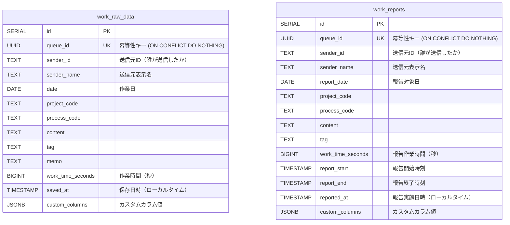

# WorkManage DB スキーマ定義

## テーブル一覧

| テーブル名 | 用途 |
|---|---|
| `work_raw_data` | 保存ごとに送信する生の作業データ |
| `work_reports` | 報告操作後に送信する集計済み報告データ |

> どちらのテーブルも **送信元識別 (`sender_id` / `sender_name`)** を持ち、送信時は「同一キー・同一送信者」の
> 既存行を削除してから入れ直す（下記「送信ロジックとスキーマ要件」参照）。

---

## ER 図



---

## DDL（PostgreSQL）

```sql
CREATE TABLE work_raw_data (
    id               SERIAL       PRIMARY KEY,
    queue_id         UUID         NOT NULL UNIQUE,
    sender_id        TEXT         NOT NULL DEFAULT '',
    sender_name      TEXT         NOT NULL DEFAULT '',
    date             DATE         NOT NULL,
    project_code     TEXT         NOT NULL DEFAULT '',
    process_code     TEXT         NOT NULL DEFAULT '',
    content          TEXT         NOT NULL DEFAULT '',
    tag              TEXT         NOT NULL DEFAULT '',
    memo             TEXT         NOT NULL DEFAULT '',
    work_time_seconds BIGINT      NOT NULL DEFAULT 0,
    saved_at         TIMESTAMP  NOT NULL,
    custom_columns   JSONB        NOT NULL DEFAULT '{}'
);

-- 送信時の DELETE（同一日・同一送信者）を高速化する
CREATE INDEX ix_work_raw_data_sender_date
    ON work_raw_data (sender_id, date);

CREATE TABLE work_reports (
    id               SERIAL       PRIMARY KEY,
    queue_id         UUID         NOT NULL UNIQUE,
    sender_id        TEXT         NOT NULL DEFAULT '',
    sender_name      TEXT         NOT NULL DEFAULT '',
    report_date      DATE         NOT NULL,
    project_code     TEXT         NOT NULL DEFAULT '',
    process_code     TEXT         NOT NULL DEFAULT '',
    content          TEXT         NOT NULL DEFAULT '',
    tag              TEXT         NOT NULL DEFAULT '',
    work_time_seconds BIGINT      NOT NULL DEFAULT 0,
    report_start     TIMESTAMP  NOT NULL,
    report_end       TIMESTAMP  NOT NULL,
    reported_at      TIMESTAMP  NOT NULL,
    custom_columns   JSONB        NOT NULL DEFAULT '{}'
);

-- 送信時の DELETE（同一報告・同一送信者）を高速化する
CREATE INDEX ix_work_reports_sender_key
    ON work_reports (sender_id, report_date, report_start, report_end);
```

---

## 既存テーブルの移行（ALTER）

`sender_id` / `sender_name` は後から追加した列。既存テーブルには以下を適用する。

```sql
ALTER TABLE work_raw_data ADD COLUMN IF NOT EXISTS sender_id   TEXT NOT NULL DEFAULT '';
ALTER TABLE work_raw_data ADD COLUMN IF NOT EXISTS sender_name TEXT NOT NULL DEFAULT '';
ALTER TABLE work_reports  ADD COLUMN IF NOT EXISTS sender_id   TEXT NOT NULL DEFAULT '';
ALTER TABLE work_reports  ADD COLUMN IF NOT EXISTS sender_name TEXT NOT NULL DEFAULT '';

CREATE INDEX IF NOT EXISTS ix_work_raw_data_sender_date
    ON work_raw_data (sender_id, date);
CREATE INDEX IF NOT EXISTS ix_work_reports_sender_key
    ON work_reports (sender_id, report_date, report_start, report_end);
```

> 列が無い状態でアプリが送信すると INSERT/DELETE が失敗し、キューに残って再試行される。

---

## 送信ロジックとスキーマ要件

送信は**キュー単位ではなく、日/報告単位でまとめて置き換える**（重複蓄積の防止）。

- **生データ (`work_raw_data`)**: 同一 `date` の中で**最新スナップショットのみ**を送る。1トランザクションで
  `DELETE FROM work_raw_data WHERE date=@date AND sender_id=@sid` → 当日分を `INSERT` → **COMMIT**。
  同一日の古いキューは送らず破棄する。
- **報告データ (`work_reports`)**: `report_date` + `report_start` + `report_end` を単位に、同一キーは最新のみ送る。
  1トランザクションで `DELETE ... WHERE report_date=@rdate AND report_start=@rstart AND report_end=@rend AND sender_id=@sid`
  → `INSERT` → **COMMIT**。

したがってスキーマ要件は以下:

- `queue_id` に **UNIQUE 制約**が必要（`INSERT ... ON CONFLICT (queue_id) DO NOTHING` の保険用）。
- `sender_id` / `sender_name` 列が必要（無いと送信失敗）。
- DELETE 述語に対応する**インデックス**（上記）を推奨。

---

## 備考

- `sender_id` / `sender_name` はアプリの「DB設定」の送信元ID・送信元名（`DbSettings.SenderId` / `SenderName`）。
  DELETE のスコープにも `sender_id` を含めるため、**複数マシン/利用者が同一テーブルに送っても互いのデータを消さない**。
- `queue_id` は WorkManage 側で生成した UUID。日/報告単位の DELETE→INSERT に加え、`ON CONFLICT (queue_id) DO NOTHING`
  を保険として併用する。
- `custom_columns` は拡張機能が追加したカスタムカラムをキーバリューで格納する (`{"ExtensionName.ColumnKey": "value"}`)。
- 時刻はすべてローカルタイムで保存する（アプリがローカル時刻前提のため `TIMESTAMP WITHOUT TIME ZONE` を使用）。
- `work_time_seconds` は調整時間（`AdjustTime`）を加算した最終的な作業時間。
